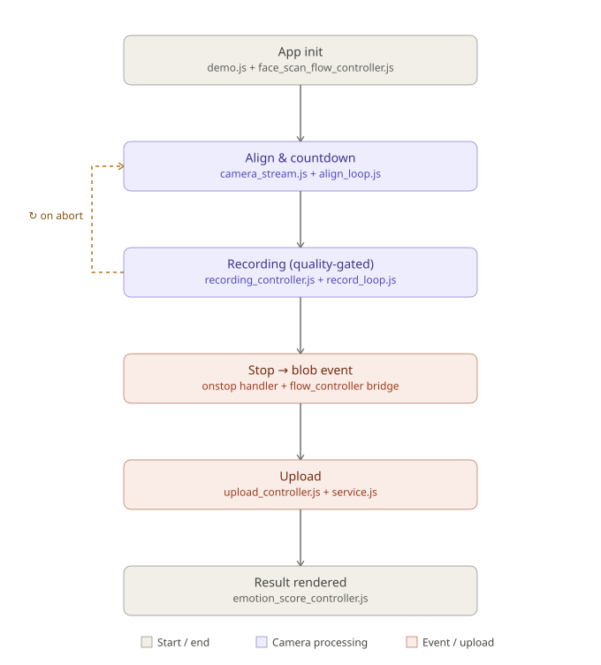

# Face scan feature architecture

This document maps every file involved in the face-scan feature (camera
capture → quality gating → recording → upload) to its responsibility, and
traces the data flow from page load through to the assessment result. For
specific tuning values (thresholds, timers) and recent change notes, see the
"Demo face scan" sections in the root [README.md](../README.md) — this
document focuses on structure and flow, not configuration values.

## Scope

"Face scan feature" here means: acquiring the camera stream, detecting and
quality-gating the face, recording a video clip, and uploading it for
assessment. Two features sit adjacent to it but are **out of scope**:

- `valence_placement_controller.js` — only toggles visibility/CSS for the
  valence-slider panel; no data dependency on face-scan output.
- `music_stream_controller.js` — the music-playback step; `demo.js`
  sequences it around face-scan steps but there's no data dependency.

`emotion_score_controller.js` **is** in scope as the terminal consumer of the
assessment result (see [Downstream: assessment result](#downstream-assessment-result)).

## Configuration values

These are the constants that actually shape user-visible behavior. Unless
noted, they live as `var` declarations near the top of
`face_scan/flow_controller.js` and are passed into the camera controller's
`config`/`cfg` object — change them there, not in the modules that consume
them.

### Timing / recording duration

| Constant | Value | Impacts |
|---|---|---|
| `ALIGN_INTERVAL_MS` | `120` | Polling cadence (ms) for both the alignment loop and the record-framing loop — how often a detection + quality sample is taken. Lower = more responsive but more CPU/detector load. |
| `STABLE_HIT_COUNT` | `4` | Consecutive good-quality alignment samples required before the 3-2-1 countdown starts. Higher = harder to trigger countdown, fewer false starts. |
| `RECORD_TARGET_MS` | `30000` | Continuous recording duration (ms) — the recorder is never paused, so this is simply how long the take runs before a normal stop. |
| `RECORD_MAX_WALL_CLOCK_MS` | `45000` | Independent safety cap (ms), unrelated to quality — guards against degenerate real-time overruns (e.g. a backgrounded tab delaying ticks). |
| `MUSIC_FADE_MS_AFTER_RECORDING_COMPLETE` | `5000` | Fade-out duration (ms) for background music once a recording's blob is ready (not when the camera starts). |

### Face framing / pose

| Constant | Value | Impacts |
|---|---|---|
| `FACE_MIN_FRAC` / `FACE_MAX_FRAC` | `0.40` / `0.72` | Acceptable face width as a fraction of the visible camera crop — too small means "move closer," too large means "move back." Drives both check 2 (centered) and check 3 (size, non-blocking — see below). |
| `FACE_PREFERRED_MIN_FRAC` / `MAX` | `0.55` / `0.65` | Preferred size band used for softer guidance messaging when the face is in-frame but not ideally sized. |
| `FACE_POSE_RATIO_MIN` / `MAX` | `0.65` / `1.35` | Fallback box width/height ratio bounds used for pose check when landmarks aren't available. |
| `FACE_MAX_LANDMARK_ROLL_RATIO` | `0.18` | Max allowed head roll (tilt), as a ratio of inter-eye distance, before pose check (4) fails. |
| `FACE_MAX_LANDMARK_YAW_RATIO` | `0.35` | Max allowed head yaw (turn), as a ratio of inter-eye distance, before pose check (4) fails. |
| `FACE_VISIBLE_MARGIN_FRAC_X` / `_Y` | `0.03` / `0.04` | Margin (fraction of visible crop) inside which forehead/cheek/nose-bridge landmarks must fall to count as "in frame" for visibility check (5). |

### Lighting / exposure

| Constant | Value | Impacts |
|---|---|---|
| `DEFAULT_FACE_MIN_MEAN_LUMINANCE` (in `face_scan/helpers.js`) | `46` | Minimum acceptable mean face luminance — below this, check 6 fails with "Move to a brighter place." |
| `FACE_MAX_MEAN_LUMINANCE` | `210` | Maximum acceptable mean face luminance — above this, check 6 fails with "Reduce direct light on your face." |
| `FACE_MAX_OVEREXPOSED_RATIO` | `0.1` | Max fraction of the face region allowed to be overexposed before check 7 fails. |
| `FACE_MAX_UNDEREXPOSED_RATIO` | `0.22` | Max fraction of the face region allowed to be underexposed (shadowed) before check 8 fails. |
| `FACE_MAX_SIDE_LUMA_ASYMMETRY` | `0.32` | Max allowed left/right luminance difference (ratio) before check 9 (lighting symmetry) fails. |

### Temporal stability (checks 10-12, gated until enough rolling samples exist)

| Constant | Value | Impacts |
|---|---|---|
| `FACE_QUALITY_HISTORY_LEN` | `24` | Rolling-window length (samples) for brightness/green/motion/frame-dt history used by the temporal checks. |
| `FACE_MAX_BRIGHTNESS_STD` | `15` | Max stddev of recent brightness samples before check 10 (brightness stability) fails — active once ≥8 samples exist. |
| `FACE_MAX_HEAD_MOTION_FRAC_PER_SAMPLE` | `0.028` | Max average per-sample head movement (fraction of crop width) before check 11 (head motion) fails — active once ≥6 samples exist. |
| `FACE_MIN_STABLE_FPS` | `15` | Minimum effective frame rate before check 12 (frame-rate stability) fails — active once ≥8 frame-interval samples exist. Was `7` before rVFC tuning; raised to `15` with tiered FPS warnings (15–24 fps allowed with amber UI). As of `face_scan/fps_monitor.js`, those samples are real camera frame intervals (via `requestVideoFrameCallback`), not the old tick-cadence approximation — at ~30fps the ≥8-sample threshold is now reached in a few hundred ms instead of ~1s. |
| `FACE_MAX_FRAME_DT_STD_RATIO` | `0.85` | Max allowed jitter (stddev/mean ratio of frame intervals) before check 12 fails. Retuned for rVFC-backed ~30fps intervals (was `0.45` for 120ms poll cadence). |
| `FACE_PRELIMINARY_RPPG_ENABLED` | `false` | Master switch for the optional check 13 (preliminary rPPG signal proxy) — disabled by default, so 13 is always a no-op pass today. |
| `FACE_PRELIMINARY_RPPG_MIN_GREEN_STD` / `MAX_GREEN_STD` | `0.8` / `30` | If check 13 were enabled, the acceptable stddev range of the green-channel signal. |

### Artifact severity / abort (`face_scan/artifact_policy.js`)

The recorder is never paused/resumed mid-take (uploaded videos must be one
continuous recording) — these tiers only decide whether to keep recording
through degraded quality or abort and discard the whole attempt.

| Constant | Value | Impacts |
|---|---|---|
| `FRAMES_MINOR_MAX` | `4` | Consecutive fail samples at/below this stay "minor" tier — recording continues, just tracked in the quality timeline. |
| `FRAMES_MODERATE_MAX` | `24` | Consecutive fail samples above minor and at/below this escalate to "moderate" — recording continues, flagged as degraded (`isDegraded`) for UI guidance and metadata. |
| `MAJOR_ABORT_STREAK` | `100` | Consecutive fail samples at/above this while in "major" tier (~12s at the 120ms sample interval) trigger `shouldAbortRecording` — discards the clip and auto-restarts the camera. Without this, a sustained total face loss would otherwise have nothing to stop a take that can never finish cleanly. |

### Encoding

| Constant | Value | Impacts |
|---|---|---|
| `RECORD_VIDEO_BPS_MP4` / `WEBM` | `2200000` / `1800000` | Desktop target bitrates (bps); chosen by `getRecordVideoBitrates()`. |
| `RECORD_VIDEO_BPS_MP4_MOBILE` / `WEBM_MOBILE` | `1200000` / `1000000` | Phone target bitrates (bps). |

### Phone trial toggles (`face_scan/flow_controller.js`)

Production defaults: both **`false`**. Full measured impact in
[face-scan-recording-performance.md](face-scan-recording-performance.md).

| Constant | Default | Impacts |
|---|---|---|
| `PHONE_RECORD_LUMINANCE_CHECKS_ENABLED` | `false` | When `false`, phone record skips checks 6–9 (`skipRecordLuminanceChecks: true`). Align still enforces lighting. |
| `PHONE_RECORD_MESH_ENABLED` | `false` | When `false`, mesh cleared during record and BlazeFace used (`skipMeshDuringRecord: true`, `useDetectorDuringRecord: true`). When `true`, mesh stays on and Landmarker runs during record. |
| `PHONE_MESH_INTRO_MS` | `2000` | **Phone only** (`phoneMeshIntroMs` is `0` on desktop). First 2 s of pre-scan: Landmarker + animated mesh. After that: BlazeFace with mesh cleared for the rest of align (matches phone record path). Desktop keeps Landmarker + mesh for the entire align phase. |

Debug metadata mirrors cfg on phone: `skip_record_luminance_checks`, `skip_mesh_during_record`, `phone_mesh_intro_ms`, `use_detector_during_align`, `skip_mesh_during_align`. On desktop, `phone_mesh_intro_ms` is `0` and align uses Landmarker throughout.

### Assessment upload (two-step wizard flow)

The demo wizard uses **paired** baseline/post uploads. Production must **not** silently fall back to the legacy single-step endpoint when pairing is missing.

| Wizard step | Scan phase | Proxy endpoint | Notes |
|---|---|---|---|
| 1 — baseline face scan | `baseline` | `POST /api/face-assess/v1/web/assess-baseline` | Multipart: age, sex, consent, `request_id`, video |
| 3 — post-music face scan | `post` | `POST /api/face-assess/v1/web/assess-post` | Same fields **plus** `baseline_token` from step 1 |

**In-memory pairing:** `state.assessment.baselineToken` is set from the baseline response field `baseline_token` and sent on the post upload. Baseline arousal/post arousal are stored separately for the results visualization.

**Production rules** (`upload_controller.js`, handled in `demo.js`):

1. Baseline upload must return `baseline_token`; otherwise the wizard stays on step 1 with an error and the user re-records baseline.
2. Post upload requires `baselineToken`; there is **no** silent fallback to `/v1/web/assess`.
3. If pairing is missing at post time, the app dispatches `maika-demo:baseline-pairing-required`, shows an error, and resets the wizard to the baseline face-scan step (music step cleared).

The legacy single endpoint `POST /api/face-assess/v1/web/assess` remains in `service.js` for standalone/non-wizard upload paths only (e.g. immediate upload in `recording_controller.js`).

### Runtime config via `<meta>` tags in `site/demo/index.html`

These configure the MediaPipe detector itself (read in
`getFaceDetectorRuntimeConfig()`, applied via `FaceScanFaceModel.setConfig`):

| Meta tag | Impacts |
|---|---|
| `maika-mediapipe-model-type` | `"landmarker"` (468-point mesh + box) or `"detector"` (box only, no mesh/visibility checks possible). |
| `maika-mediapipe-js-cdn` | Which `@mediapipe/tasks-vision` build to load. |
| `maika-mediapipe-wasm-root` | Where the WASM runtime is fetched from. |
| `maika-mediapipe-model-url` | Which model asset (landmarker/detector `.task`/`.tflite` file) to load. |
| `maika-mediapipe-delegate` | `"GPU"` or `"CPU"` inference delegate. |
| `maika-mediapipe-min-detection-confidence` | Detector confidence threshold (detector mode only). |

## File responsibility map

```
site/demo/js/demo.js
  Wizard entry point. Calls initFaceScanFlow() once at page load. Drives
  camera start/restart from wizard step transitions. Owns the two DOM
  CustomEvent listeners that bridge face-scan output into the wizard state
  (state.upload, state.assessment) and trigger the next step.

site/demo/js/controller/face_scan/flow_controller.js
  Feature orchestrator. Owns the shared `context` (ctx) object, all DOM
  element refs, model bootstrap, UI panel/overlay transitions, consent
  gating, and the bridges object that wires the camera controller and
  recording controller together. Builds both controllers exactly once and
  reuses them across scans (no re-instantiation).

site/demo/js/controller/face_scan/camera_controller.js
  Composition root. Builds the shared per-instance `state` (ctx, elements,
  config, bridges, faceMesh renderer) and returns the public camera API
  consumed by the flow controller and the recording controller. Owns no
  loop/stream logic itself — delegates to the 5 modules below.

site/demo/js/controller/face_scan/camera_stream.js
  getUserMedia lifecycle: requestCameraAndStartAlignment / stopStream.
  Re-entrancy guard (cameraRequestInFlight), stale-request generation
  counter (streamRequestGen), and track.onended disconnect handling. Runs
  the warmup phase (face_scan/warmup.js) between camera-ready and align.

site/demo/js/controller/face_scan/warmup.js
  Fixed-duration warmup phase (startWarmup / stopWarmup) between camera-ready
  and alignment: lets auto-exposure/autofocus settle, takes a one-time
  ambient brightness/FPS baseline (ctx.warmupSummary, kept separate from the
  live rolling-history arrays align resets on start), and primes the face
  detector. A dependency of face_scan/camera_stream.js, not of the
  composition root directly.

site/demo/js/controller/face_scan/fps_monitor.js
  Real delivered-FPS measurement via requestVideoFrameCallback (with a
  requestAnimationFrame + video.currentTime fallback), replacing the old
  tick-cadence approximation. Runs continuously from stream-attached to
  stream-teardown, feeding ctx.quality.frameDtHistory directly (same field
  the temporal-stability check already reads). Also maintains a
  recording-phase-scoped sample set (reset at record start, finalized into
  ctx.cameraMetadata's delivered_fps_overall/mean/median/p10/min/std,
  frame_count/estimated_frame_count (total frames captured, both equal),
  frame_timestamp_jitter_ms,
  long_frame_*, recording_duration_ms/duration_ms, max_inter_frame_gap_ms, fps_monitor_mode,
  suppressed_gap_* fields at record stop). A dependency of
  face_scan/camera_stream.js and face_scan/recording_controller.js, not of
  the composition root directly.

site/demo/js/controller/face_scan/align_loop.js
  Alignment polling loop (tickAlignment / startAlignLoop / stopAlignLoop)
  and the 3-2-1 countdown (runCountdownThenRecord / cancelCountdown) that
  follows a stable alignment. Phone-only: `detectFaceForAlignPhase` (Landmarker
  for first `phoneMeshIntroMs`, then BlazeFace) and `syncAlignMeshDuringTick`
  (mesh intro then cleared). Desktop: Landmarker + mesh every tick.

site/demo/js/controller/face_scan/record_loop.js
  Record-framing polling loop (tickCameraRecordFraming /
  startRecordFramingLoop / stopRecordFramingLoop): runs quality checks
  during recording and tracks the recording-duration budget. The recorder
  is never paused/resumed mid-take (uploaded videos must be one continuous
  recording) — degraded quality only flags UI guidance via the artifact
  policy; only a sustained major artifact aborts and discards the take.

site/demo/js/controller/face_scan/camera_fx.js
  Pure overlay rendering: face-scan-fx clip/target guide sync
  (syncFaceScanFx), face-mesh wireframe sync (syncFaceMesh/clearFaceMesh),
  camera loading/denied overlay toggles.

site/demo/js/controller/face_scan/detection_utils.js
  Leaf module: normalizes raw detector payloads into { box, landmarks }.
  No dependencies, used by both polling loops.

site/demo/js/controller/face_scan/mesh_renderer.js
  Animated canvas renderer for the face-mesh overlay (createFaceMeshRenderer
  → { draw, clear }). Runs a self-pacing RAF loop with a 3.6 s cycle: mesh
  builds left→right, holds full, sweeps with a glow bar, shows sparse tracking
  dots, then fades. All moving elements are constrained to the live face
  bounding box. Upper-face landmarks stretched upward by MESH_EXPAND_TOP=1.30
  to reach the full forehead. Color is purple (aligning) or green-teal (ok).

site/demo/js/controller/face_scan/quality_checks.js
  The 13 face-quality checks (face present, centered, size, pose, anatomy
  visibility, brightness/exposure/symmetry, temporal stability, optional
  rPPG proxy). Orchestrates check order + early exit, then runs the result
  through the artifact policy.

site/demo/js/controller/face_scan/quality_helpers.js
  Shared helpers for the checks above: pose/visibility evaluation, skin
  classification, rolling-history temporal stability (brightness/motion/fps),
  and quality-report publishing for debug logs.

site/demo/js/controller/face_scan/artifact_policy.js
  Maps a failing quality check to a severity tier (minor/moderate/major)
  based on consecutive-fail streaks, decides whether the active recording
  is merely flagged as degraded or should abort entirely, and tracks the
  quality timeline segments.

site/demo/js/controller/face_scan/recording_controller.js
  MediaRecorder session lifecycle: start recording after countdown, chunk
  collection, recording-pill timer UI, onstop handling (discard-and-restart
  vs. produce blob), calls into the camera controller's public API
  (stopRecordFramingLoop/startRecordFramingLoop/syncFaceScanFx/stopStream).

site/demo/js/utils/face_scan/face_model.js
  MediaPipe FaceLandmarker/FaceDetector loader and config. Exposes
  detectSingleFace() (box + landmarks) and getFaceMeshTesselation() (mesh
  connection pairs, populated once the landmarker model loads).

site/demo/js/utils/face_scan/helpers.js
  Shared stateless utilities: object-fit:cover crop math
  (getCoverVisibleRegion), face-framing geometry (isFaceWellFramed,
  computeFaceScanEllipse), recorder helpers (createRecorder, pickMimeType),
  placement UI text/state, camera-error messages.

site/demo/js/utils/face_scan/debug.js
  Structured console logging gated by a meta tag / URL flag, with dedupe
  per phase. Filter DevTools by `[Maika FaceScan]`.

site/demo/js/controller/face_scan/upload_controller.js
  Owns the actual network upload of the recorded blob (startFaceUpload),
  applies the result to wizard state (state.assessment), dispatches the
  "upload complete" event that advances the wizard.

site/demo/js/service/service.js
  FaceScanUpload: builds multipart FormData (age/sex/consent/request_id + video
  blob; post adds baseline_token) and posts to the same-origin proxy:
  assess-baseline / assess-post for the wizard, or legacy assess for
  standalone paths. Returns { ok, status, errorMessage, data }.

site/demo/js/controller/emotion_score_controller.js
  Terminal consumer: reads state.assessment (baseline/post arousal,
  valence) and renders the score visualization at the results step.

site/demo/index.html
  Markup: #preview video, #face-scan-mesh canvas, face-scan-fx overlay divs,
  scan stage/overlay elements, consent checkbox, action buttons.

site/demo/css/face_scanner.css, face_scanner_fx.css
  Styling for the scan panel, overlays, and FX/mesh canvas positioning.
```

## Data flow

High-level view of the 6 stages below, plus the one non-linear path: a
sustained major quality failure during recording discards the clip and
restarts alignment instead of continuing forward.



### 1. Page load → flow controller ready (no camera yet)

```
demo.js (module load)
  → initFaceScanFlow()                          [face_scan/flow_controller.js]
      → getDomReferences()                      collects all DOM element refs
      → createRecordingController(...)          [face_scan/recording_controller.js]
      → createCameraController(recording)        [face_scan/camera_controller.js]
          → createCameraControllerState(spec)    builds shared `state`
              { ctx, el, cfg, bridges, faceMesh }
      → bindFaceScanEvents(camera, recording)    wires button click handlers
      → bootstrapModels()                        [face_scan/face_model.js] loads
                                                  MediaPipe FaceLandmarker in
                                                  the background
```

Both controllers are created exactly once and stored in
`faceScanFlowHandles`; every later scan (including the post-music second
scan) reuses the same `camera`/`recording` instances rather than recreating
them — this is the fix from the "made the camera not to instantiate
repeatedly" commit.

### 2. Camera start → warmup → alignment → countdown

Triggered by `btnStart` click (first scan, after consent) or
`autoStartFaceScanDirectly()` (second scan, no consent re-check):

```
flow_controller: openScanPanelAndRequestCamera(camera)
  → waitForModelsThenOpenCamera(camera)
      → camera.requestCameraAndStartAlignment()  [face_scan/camera_stream.js]
          → navigator.mediaDevices.getUserMedia(...)
          → attach stream to <video id="preview">
          → bridges.onCameraReady()               (flow_controller: overlay → "camera" stage,
                                                     "preparing your camera" tip)
          → startWarmup(state, onComplete)         [face_scan/warmup.js]
              → ~2.5s of ambient brightness/FPS sampling + detector priming
              → onComplete: bridges.onAlignmentStart()  (overlay → "align" stage/tip)
          → startAlignLoop(state)                  [face_scan/align_loop.js]
              → setInterval(tickAlignment, alignIntervalMs)
                  tickAlignment:
                    → detectFaceForAlignPhase(preview)       [align_loop.js: Landmarker on desktop;
                                                               phone: Landmarker 2s then BlazeFace]
                    → extractBoxFromDetection/Landmarks     [detection_utils.js]
                    → evaluateFaceQuality(...)              [quality_checks.js]
                        → applyArtifactPolicy(...)          [artifact_policy.js]
                    → syncFaceScanFx / syncAlignMeshDuringTick [camera_fx.js via align_loop.js]
                    → on `stableHitCount` consecutive passes:
                        stopAlignLoop()
                        runCountdownThenRecord(state)        [align_loop.js]
                            → 3-2-1 countdown
                            → bridges.onCountdownDone()      (flow_controller)
                                → recording.beginRecording() [face_scan/recording_controller.js]
```

### 3. Recording → quality-gated, never paused → stop

The recorder is never paused/resumed mid-take — an uploaded video must be one
continuous recording from t=0 to the end. Degraded quality only changes the
UI guidance; only a sustained major artifact stops and discards the take.

```
recording.beginRecording()
  → camera.stopRecordFramingLoop()  (defensive, ensures clean state)
  → ctx.recorder = H.createRecorder(ctx.stream, ...)   [face_scan/helpers.js]
  → camera.startRecordFramingLoop()                    [face_scan/record_loop.js]
      → setInterval(tickCameraRecordFraming, alignIntervalMs)
          tickCameraRecordFraming:
            → detectForRecord(preview) → evaluateFaceQuality(...)
              [record_loop.js: Landmarker on desktop; BlazeFace on phone]
            → quality.artifact.shouldAbortRecording?  → discard + auto-restart
            → quality.artifact.isDegraded?            → update placement UI
                                                          to "bad", recording
                                                          keeps running
            → otherwise → update placement UI to "good"/"wait"
            → in all non-abort cases → accumulate recordBudgetAccumMs
            → recordBudgetAccumMs >= RECORD_TARGET_MS? → rec.stop()
  → ctx.recorder.onstop = createRecorderStopHandler(state, camera, resolve)
                                                        [face_scan/recording_controller.js]
```

### 4. Recording stop → blob or discard

`createRecorderStopHandler`'s `onstop` (`face_scan/recording_controller.js`):

```
onstop:
  → camera.syncFaceScanFx(null); camera.stopRecordFramingLoop()
  → camera.stopStream()                                [face_scan/camera_stream.js]
  → finalizeArtifactTimeline(ctx, now)                  [face_scan/artifact_policy.js]
  → discard flagged (quality abort / too many pauses)?
        → bridges.onQualityRestart(message, qualityTimeline)   (auto-restart path)
          or bridges.resetUiToStart()
  → otherwise → build Blob from chunks
        → deferAssessUpload === true (always true today)
            → bridges.onRecordingBlobReady(blob, mime, baseTxt)
```

### 5. Blob ready → event → upload → wizard advance

`onRecordingBlobReady` is implemented in `face_scan/flow_controller.js`:

```
bridges.onRecordingBlobReady(blob, mime, baseTxt)
  → stopMusicPlayback({ fadeOutMs: ... })
  → document.dispatchEvent("maika-demo:face-scan-blob-ready", {
        blob, recordedMime, baseTxt, consentGiven, qualityTimeline })

demo.js listener on "maika-demo:face-scan-blob-ready":
  → store blob on state.upload.pending*
  → applyRecordedPreview(dom, state, blob)        (render <video> preview)
  → startFaceUpload(dom, state, setWizardError)    [face_scan/upload_controller.js]
      → postRecording(blob, endpoint, { age, sex, consent, requestId, baselineToken? })
          baseline step 0 → POST …/assess-baseline
          post step 2     → POST …/assess-post (requires baseline_token)
      → on baseline success: store baseline_token + baselineArousal
      → on post success: store postArousal
      → document.dispatchEvent("maika-demo:face-upload-complete", { scanPhase })

demo.js listener on "maika-demo:face-upload-complete":
  → phase "baseline" → advance wizard to music step
  → phase "post"     → advance wizard to results step

demo.js listener on "maika-demo:baseline-pairing-required":
  → missing baseline_token at post (or baseline response lacked token)
  → reset wizard to baseline face-scan step; show error; restart baseline camera flow
```

`maika-demo:face-scan-blob-cleared` is the inverse event (dispatched from
`resetUiToStart` in the flow controller) — `demo.js` listens for it to clear
the uploaded/pending state and reset the recorded-preview UI when the user
cancels or restarts.

### 6. Downstream: assessment result

At the results step, `emotion_score_controller.js`'s `render()` reads
`state.assessment.baselineArousal` / `.postArousal` (and a derived
`getArousal()` = `(postArousal - baselineArousal) / 2`, plus valence from the
slider step) to render the score visualization. This is the terminal
consumer of the face-scan pipeline's output — nothing downstream of it feeds
back into face-scan state.

## Shared state objects

Two distinct "shared state" objects flow through this feature — don't
confuse them:

- **`ctx`** (created in `face_scan/flow_controller.js`, passed to both
  `createCameraController` and `createRecordingController`): the
  cross-controller fields — `phase`, `stream`, `recorder`, timers, quality
  histories, artifact-policy bookkeeping (`discardCurrentRecording`,
  `autoRestartCameraAfterAbort`, `qualityRestartMessage`, `qualityTimeline`).
  This is the single source of truth both controllers read/write to
  coordinate without calling each other's internals directly.
- **`state`** (built once per controller instance by
  `createCameraControllerState`/`createRecordingControllerState`): wraps
  `ctx` plus that controller's own `{ el, cfg, bridges }` and (camera-only)
  the `faceMesh` renderer instance. This is the object threaded through every
  function in the 5 camera-controller modules — never passed outside the
  camera controller's own files.

## Module boundary / public contract


The camera controller's public surface (`FaceScanCameraController.create(spec)`
→ object with `hideScanCameraStates`, `showCameraDeniedOverlay`,
`requestCameraAndStartAlignment`, `stopStream`, `stopAlignLoop`,
`startAlignLoop`, `stopRecordFramingLoop`, `startRecordFramingLoop`,
`syncFaceScanFx`, `runCountdownThenRecord`, `cancelCountdown`) is the only
thing `face_scan/flow_controller.js` and `face_scan/recording_controller.js`
depend on — neither imports anything from the 5 internal modules directly.
This means the internal split (stream/align/record/fx/detection-utils) can
be refactored further without touching either consumer, as long as this
method list stays stable.

## Camera warmup phase

A fixed **2500 ms** warmup (`WARMUP_DURATION_MS`) runs in `face_scan/warmup.js`
right after the camera stream attaches and before any alignment quality-gating
starts. Its purpose: let auto-exposure/autofocus settle, take a one-time ambient
brightness/FPS baseline, and prime the face detector for align's first real tick.

Key design choices:
- The warmup baseline is stored in `ctx.warmupSummary` (not in
  `ctx.quality.brightnessHistory` / `frameDtHistory`), because `startAlignLoop`
  resets those arrays the moment it starts — feeding warmup samples into them
  would just get wiped.
- The warmup FPS figure (`ctx.warmupSummary.baselineFps`) is a rough
  tick-interval average, not a `face_scan/fps_monitor.js` sample — it's a
  one-time snapshot for diagnostics only.
- UI: `onCameraReady` shows "Hold steady — preparing your camera…" during
  warmup; `onAlignmentStart` (fired when warmup completes) switches to the
  alignment-guide tip.

## Post-scan startup behavior

Post-music scan uses a single entry path in `site/demo/js/demo.js`:

- `startPostScanCapture(dom, state)` handles all setup and starts the camera
  once via `restartFaceScanForNewRecording()`.
- A previously stray `requestAnimationFrame(autoStartFaceScanDirectly)` call
  that could cause a duplicate camera start was removed.

Both controllers (`camera` and `recording`) are created **once** at page load and
reused across all scan attempts — including the post-music second scan. See
[Shared state objects](#shared-state-objects) for the `ctx`/`state` distinction.

## Related documentation

- [face-scan-recording-performance.md](face-scan-recording-performance.md) —
  phone vs desktop tuning, frame-count targets, rollback guide.
- [face-scan-visual-overlay.md](face-scan-visual-overlay.md) —
  face mesh canvas overlay: animation cycle, forehead expansion, sweep mechanics.
- [face-scan-pre-production-testing.md](face-scan-pre-production-testing.md) —
  pre-production testing checklist and sign-off template.
